# 1. Distributed Web Infrastructure

## 🌐 Scenario

A user wants to access `www.foobar.com`. In this setup, the infrastructure uses three servers to ensure better reliability, scalability, and performance.

---

## 🗺️ Infrastructure Diagram (Mermaid.js - GitHub Compatible)

```mermaid
graph TD
    User[User - Browser]
    DNS[DNS - wwwfoobar.com → Load Balancer IP]
    LB[Load Balancer - HAProxy]

    subgraph Web Server Cluster
        S1[Server 1 - Nginx, App, Primary DB]
        S2[Server 2 - Nginx, App, Replica DB]
    end

    User --> DNS --> LB
    LB --> S1
    LB --> S2
    S1 --> DBPrimary[Primary DB]
    S2 --> DBReplica[Replica DB]
```

---

## 🧱 Components Breakdown

### ➕ Additional Elements and Why

| Component     | Reason                                                                 |
|---------------|------------------------------------------------------------------------|
| **Load Balancer (HAProxy)** | Distributes traffic between servers to avoid overloading one machine. |
| **Two Web Servers**         | Improves redundancy and allows parallel handling of user requests. |
| **Primary-Replica DB**      | Supports data redundancy and load sharing in reads. |

---

## 🔄 Load Balancer

- **Tool**: HAProxy
- **Algorithm**: *Round Robin*
  - Distributes requests in a circular sequence: Server 1, Server 2, Server 1, etc.
- **Setup**: *Active-Active*
  - Both servers are actively handling requests at the same time.
  - **Active-Active vs. Active-Passive**:
    - **Active-Active**: All servers handle traffic simultaneously.
    - **Active-Passive**: One server handles traffic, the other waits to take over if the first fails.

---

## 🗃️ Primary-Replica Database

### How it works:
- The **Primary** database (on Server 1) handles all **write** operations.
- The **Replica** (on Server 2) receives synchronized **read-only** copies of the data.
- Replication is usually **asynchronous**, so there's a slight delay.

### From the App’s Perspective:
- **Writes** → go to the **Primary**
- **Reads** → can be handled by either the **Primary** or **Replica** to improve speed and load distribution.

---

## ⚠️ Infrastructure Issues

| Issue Type    | Explanation                                                                 |
|---------------|------------------------------------------------------------------------------|
| **SPOF**       | The Load Balancer itself is a Single Point of Failure (SPOF) unless replicated. |
| **Security**   | No firewall, no HTTPS → vulnerable to attacks and data leakage.            |
| **Monitoring** | No monitoring tools → no alerts or diagnostics for system failures.        |

---

