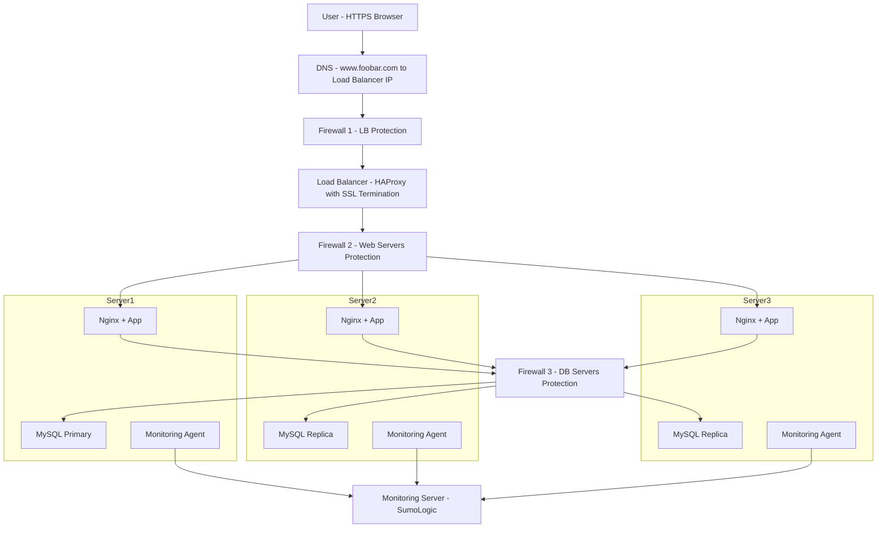

# 2. Secured and Monitored Web Infrastructure

## 🌐 Scenario

We want to host the website `www.foobar.com` on a three-server infrastructure. This infrastructure must be **secure**, serve **encrypted traffic** (HTTPS), and be **monitored** effectively.

---

## 🗺️ Infrastructure Diagram 

---

## 🔐 Security Components

### ➕ Why Add These Elements?

| Component         | Purpose |
|------------------|---------|
| **Firewalls (x3)** | Restrict access to network layers (LB, web/app, DB). Prevent unauthorized traffic. |
| **SSL Certificate** | Enables secure (HTTPS) connections, protects data in transit. |
| **Monitoring Agents (x3)** | Collect logs, metrics, and performance data for analysis and alerting. |

---

## 🧱 Firewalls

- **Firewall 1**: Filters incoming traffic before reaching the Load Balancer.
- **Firewall 2**: Filters traffic between Load Balancer and Web/Application Servers.
- **Firewall 3**: Protects the Database servers from external access.

### 🔥 What Are Firewalls For?

- Prevent unauthorized access.
- Enforce network segmentation.
- Only allow trusted ports (e.g., 443 for HTTPS, 3306 for MySQL).

---

## 🔒 HTTPS & SSL

### Why Serve Over HTTPS?

- **Encrypts** communication between the user and the server.
- **Protects** against eavesdropping, man-in-the-middle attacks.
- **Builds trust** with users (e.g., browser padlock symbol).

---

## 📈 Monitoring

### What is Monitoring Used For?

- Track **performance** (load, latency, errors).
- Collect **logs** and **metrics**.
- Trigger **alerts** on anomalies or failures.

### How is Monitoring Done?

- Each server runs a **monitoring agent** (e.g., SumoLogic, Prometheus).
- Agents **push** data to a central monitoring service.
- Metrics like CPU, memory, disk usage, logs, QPS, etc., are analyzed.

### How to Monitor Web Server QPS (Queries Per Second)?

- Use **Nginx logs** or a status endpoint (e.g., `/status`) via modules like `ngx_http_stub_status_module`.
- Extract request count and compute QPS in the monitoring system (e.g., using dashboards or alert rules).

---

## ⚠️ Potential Issues

### 1. **SSL Termination at Load Balancer**

- If SSL ends at the Load Balancer, internal traffic is in **plain HTTP**, which can be intercepted unless secured.
- **Better**: Use SSL passthrough or re-encrypt to backend.

### 2. **Only One MySQL Primary Server**

- Becomes a **Single Point of Failure** for writes.
- Load can't be distributed for write-heavy applications.
- **Better**: Consider multi-primary setups or automatic failover systems.

### 3. **All-in-One Servers**

- Each server has **Nginx + App + DB**:
  - Difficult to scale individual components.
  - Wastes resources if only one layer is overloaded.
- **Better**: Use specialized servers (separate tiers for web, app, and DB).

---
