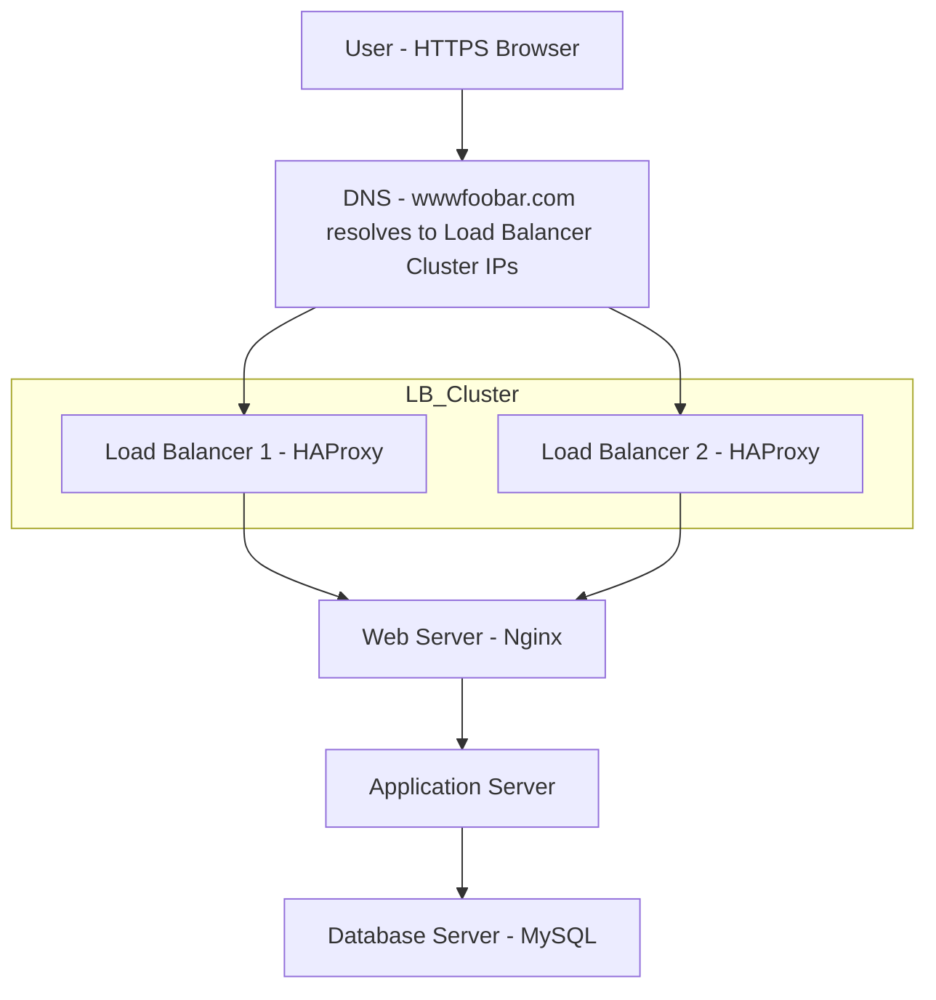

# Scalable Web Infrastructure Design

## Introduction
This document outlines a scalable web infrastructure design that separates components onto dedicated servers and implements high availability through load balancing.

## Infrastructure Design

## Why Add These Elements?

### Load Balancer Cluster (2 HAProxy instances):
- Adding two load balancers configured as a cluster provides **high availability** and **fault tolerance**.
- If one load balancer goes down, the other can continue handling incoming user traffic without interruption.
- HAProxy can distribute traffic evenly across multiple servers, preventing any single server from becoming overwhelmed.

### Dedicated Web Server:
- The web server handles all HTTP/S requests, serving static files like images, CSS, and JavaScript.
- It acts as the first point of contact after the load balancer and improves performance by offloading static content delivery.
- Nginx is optimized for serving static content with minimal resource usage.

### Dedicated Application Server:
- The application server runs the business logic and processes dynamic requests.
- Separating it from the web server allows easier scaling and maintenance.
- Can be optimized specifically for application performance rather than serving static files.

### Dedicated Database Server:
- The database server stores and manages persistent data.
- Isolating it improves data security, backup management, and database performance.
- Prevents database operations from competing with web or application processes for resources.

## Application Server vs Web Server

### Web Server (e.g., Nginx):
- Responsible for handling client HTTP requests, serving static content, and proxying dynamic requests to the application server.
- Optimized for serving files and managing connections efficiently.
- Handles SSL termination, compression, and caching.

### Application Server:
- Responsible for executing the application's backend logic, processing data, handling authentication, and interacting with the database.
- Runs the actual application code (PHP, Python, Ruby, Node.js, etc.).
- Processes business logic and generates dynamic content.

By splitting the web server and application server, each can be scaled or maintained independently, improving flexibility and reliability.

## Scale-Up Scenario

When traffic increases, this infrastructure design allows for:

1. **Horizontal Scaling**: Adding more servers at any tier (web, application, or database)
2. **Vertical Scaling**: Increasing resources (CPU, RAM) for specific components as needed
3. **Independent Optimization**: Tuning each component for its specific workload

## Summary

This infrastructure design enables better:
1. **Scalability**: Components can be scaled independently based on specific needs
2. **High Availability**: Load balancer clustering ensures continuous service even if one fails
3. **Performance**: Dedicated servers for specific tasks prevent resource contention
4. **Maintenance**: Individual components can be updated or replaced without affecting others
5. **Security**: Improved isolation between components reduces attack surface

The separation of concerns allows for more efficient resource allocation, easier troubleshooting, and better overall system reliability compared to a single-server approach.